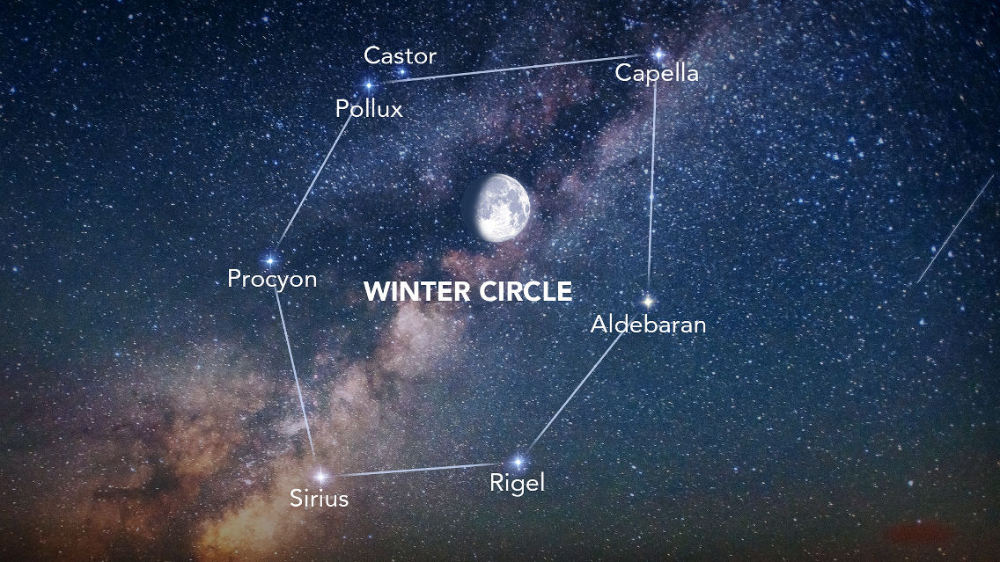

# Procyon

*A tiny rendering engine for self learning.*

Procyon is the brightest star in the constellation of Canis Minor and usually the eighth-brightest star in the night sky, with an apparent visual magnitude of 0.34. It is a binary star system in Canis Minor (the lesser dog), which is a constellation in the Northern Hemisphere. This system consists of a white-hued main-sequence star of spectral type F5 IV–V and lies at a distance of just 11.46 light-years (3.51 parsecs), and is therefore one of Earth's nearest stellar neighbors. 

Coding...

## Building

### Dependencies

// TODO

### Requirements

// TODO

## Modules

// TODO

## Features

// TODO

## Getting started

// TODO

## Screenshots

// TODO

## Licences

// TODO
